## Contents

-   Background
-   Why & When
-   What & How
-   Do's and Don'ts
-   Activity *(if time permits)*

##
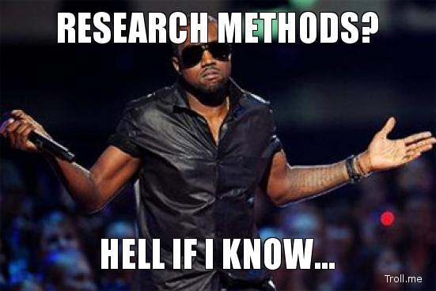{fig-align="center"}

## Background

```{mermaid}
%%| fig-width: 10
%%| fig-height: 3
%%| fig-responsive: true
flowchart LR
  I[Introduction] --> M[Methods] --> R[Results] --> D[Discussion]
```

-   **I** — why you did it
-   **M** — *what you did* ← **this session**
-   **R** — what you found
-   **D** — what it means

## Background

-   Methods + Results are the **factual spine** of a research paper.

-   Introduction and Discussion are interpretation

-   It is the only section that cannot be improved after the study is finished.

## Read in one order, written in another {.smaller}

::::: columns
::: {.column width="50%"}
**Readers move top-down**

1.  Title
2.  Abstract
3.  Introduction
4.  Methods
5.  Results
6.  Discussion
:::

::: {.column width="50%"}
**Smart writers start in the middle**

1.  **Methods**
2.  Results
3.  Discussion
4.  Introduction
5.  Abstract
6.  Title
:::
:::::

## Methodology is the Recipe of your Research

<br>

::: callout-note
### Chicken Biryani (serves 4)

1.  Marinate the chicken in yogurt and spices for `______`
2.  `____________________________`
3.  Layer rice and chicken in a heavy-bottomed pot
4.  Cook on `______` heat for `______` minutes
5.  `____________________________`
6.  Garnish with fried onions and serve
:::

. . .

::: {.callout-tip appearance="simple"}
What's missing?
:::

## The same gaps in a Methods paragraph

<br>

> "A `______` study was conducted at `______`. Data were collected using a `______`. `______` statistical tests were applied. Results were considered significant at p \< 0.05."

<br>

. . .

::: important
Reviewers see this and react exactly as you did to the biryani.
:::

## Reproducibility Matters

:::::: columns
::: {.column width="45%"}
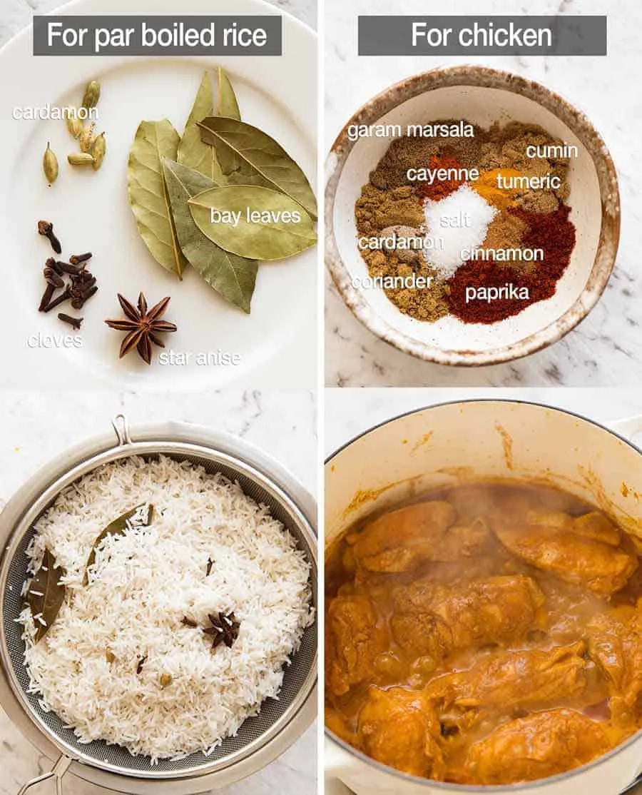{fig-align="center"}
:::

::: {.column width="10%"}
:::

::: {.column width="45%"}
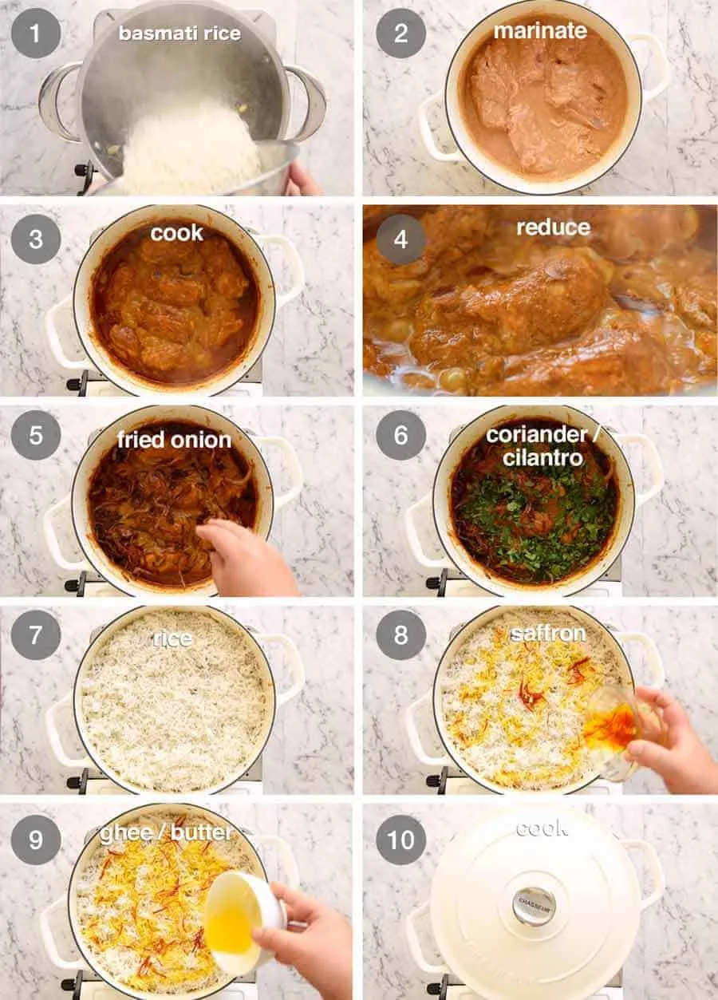{fig-align="center"}
:::
::::::

## Reproducibility Matters 

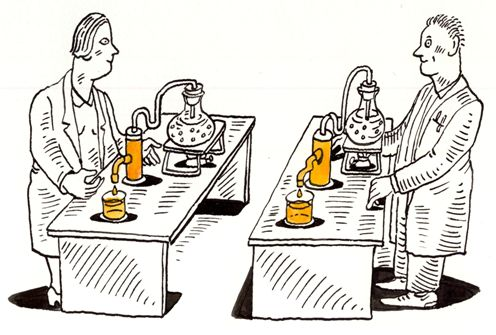{fig-align="center"}

## Reproducibility Matters

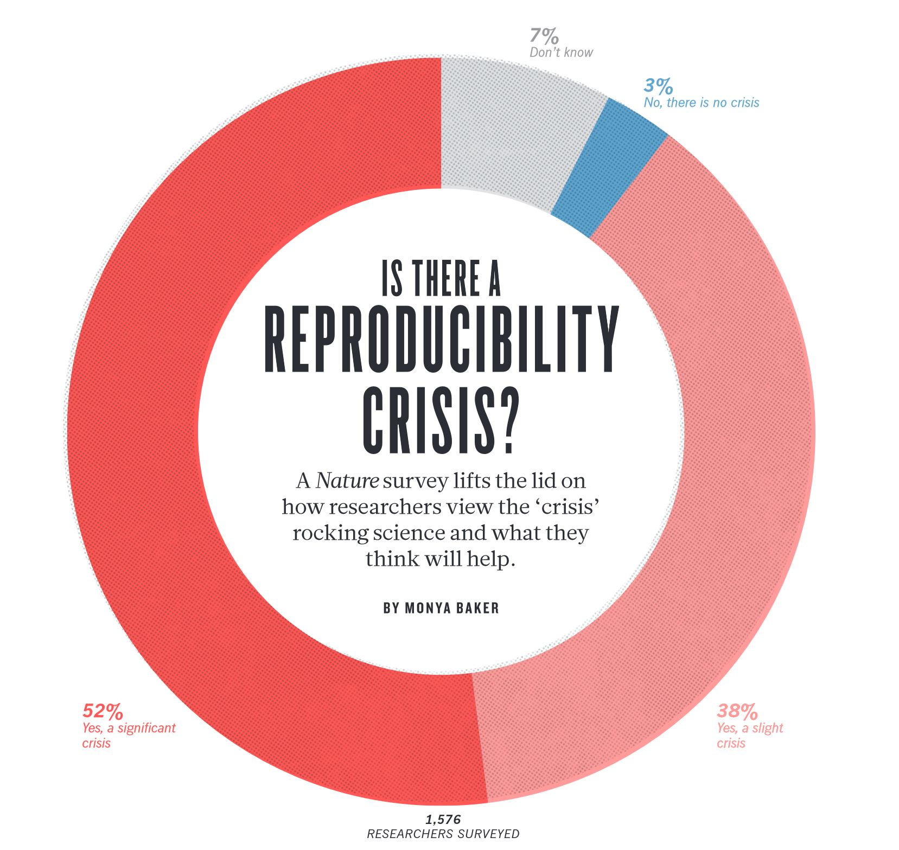{fig-align="center"}

## Reproducibility Matters

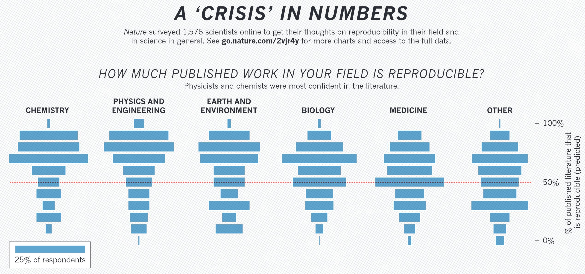{fig-align="center"}

## Reproducibile Research

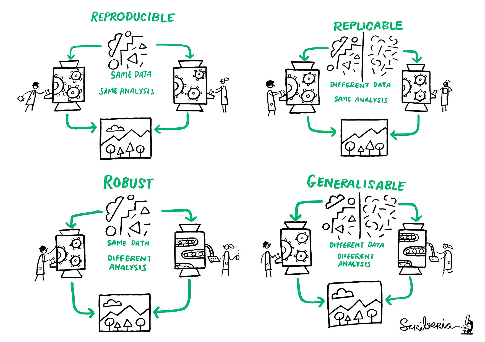{fig-align="center"}

## Reproducibility Spectrum

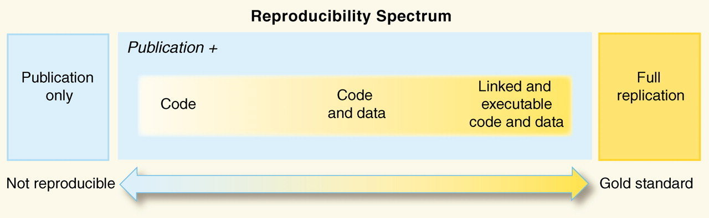{fig-align="center"}

## A useful trick

Write as if explaining it to yourself, two years from now, at a different hospital/lab setting with no access to your files.

. . .

<br>

Methods answers four questions about the study: 

. . . 

**what** <br> 

. . . 

**how** <br>

. . .

**which** <br> 

. . . 

**why**

## Who reads Methods and why {.smaller}

<br>

. . .

| READER | PURPOSE |
|:-----------------------------------|:-----------------------------------|
| **Editors & reviewers** | judge validity and whether the design fits the question |
| **Replicators** | reproduce your study |
| **Systematic reviewers** | assess risk of bias (Cochrane RoB maps onto your Methods) |
| **Future you** | remember exactly what you did |

. . . 

<br>

::: {.callout-note appearance="simple"}
Transparent methods signal credibility, not just compliance.
:::

## How much detail? {.smaller}

::::: columns
::: {.column width="50%"}
**Include** anything that affects the result or its reprodubility

-   Eligibility & exclusion criteria

-   Reagent concentrations, kit/catalogue & **lot** numbers, manufacturer

-   Instrument settings, calibration

-   Software **name + version**

-   Protocol deviations
:::

. . . 

::: {.column width="50%"}
**Leave out** trivia and interpretation

-   *"A blue 500 ml beaker was used."*

-   Step-by-step re-description of a **standard** method → *cite* it instead

-   **Results** (no numbers of findings)

-   Why other methods are "worse"
:::
:::::

<br>

::: {.callout-note appearance="simple"}
When unsure, **more** detail, informed by journal limits, can always add supplementary material.
:::

## Tense & Voice

::::: columns
::: {.column width="50%"}
-   **Past tense** <br> the study is done (*"samples were analysed"*).
-   Future tense is the tell-tale sign of a pasted protocol/grant.
-   Voice is discipline-dependent (passive traditional in biomedicine, active increasingly fine); must follow the journal.
:::

::: {.column width="50%"}
-   Describe procedures in the order the Results will report them.
-   Each procedure paragraph: purpose first, then how.
-   *"To compare X across groups, assay Y (maker) was performed…"*
:::
:::::

## When to draft the Methods Section?

-   Draft the methods section before you start the research

-   Write it fresh, without looking at the protocol

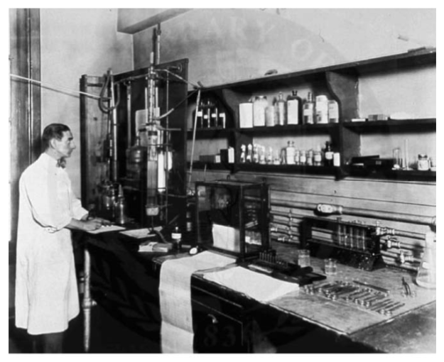{fig-align="center"}

# What goes in Methods?

## The Universal Core  {.smaller}

### Needed in *every* design

::::: columns
::: {.column width="50%"}
1.  **Study design** — named explicitly
2.  **Setting** — place, level of care, time frame
3.  **Ethics** — IEC no. + date, consent, registration
4.  **Eligibility** — inclusion / exclusion with cut-offs
5.  **Sample size** — with assumptions
:::

::: {.column width="50%"}
6.  **Variables & tools** — named, validated
7.  **Statistics** — tests, model, effect measures
8.  **Software** — name + version (+ code)
:::
:::::

<br>

. . . 

::: {.callout-note appearance="simple"}
Get these right and you clear the bar that applies to **any** study.
:::

## ICMJE: three drawers for your Methods

:::::: columns
::: {.column width="33%"}
**1 · Participants**

selection, eligibility, source population
:::

. . .

::: {.column width="33%"}
**2 · Data & measurements**

variables, tools, procedures
:::

. . . 

::: {.column width="33%"}
**3 · Statistics**

tests, models, software
:::
::::::

<br>

. . .

If a sentence doesn't fit one of these drawers, it probably belongs in **Results**.

## From vague to precise 

::: panel-tabset
### Design

"A study was done to assess anaemia in pregnant women."

:::{.fragment}
$$ \downarrow $$

"We conducted a **hospital-based cross-sectional study** of pregnant women attending the antenatal clinic of a tertiary hospital, Jan–Dec 2024."

:::

### Ethics

"Ethical clearance was obtained."

:::{.fragment}

$$ \downarrow $$

"Approved by the IEC (IEC No. …/2024, dated 15 Jan 2024). Written informed consent was obtained. Prospectively registered with CTRI (CTRI/2024/…)."

:::

### Sample size

:::{.fragment}

"A sample of 200 was taken by convenience."


$$ \downarrow $$

"Assuming 30% prevalence, 5% precision, 95% CI and design effect 1.5, the required size was 323; we enrolled 350 for 10% non-response."

:::

### Statistics

"Data were analysed using appropriate tests; p\<0.05 was significant."

:::{.fragment}

$$ \downarrow $$

"χ² for categorical and t-test for continuous variables; multivariable logistic regression adjusted for age, sex, SES, reporting adjusted ORs with 95% CIs."

:::

### Software

"Analysis was done on computer."

:::{.fragment}

$$ \downarrow $$

"Analyses used **R v4.4.1** with the `tidyverse` and `survey` packages."
:::

:::

## Study Design dictates which elements are necessary {.smaller}

::: panel-tabset
### Cross-sectional

-   Exposure + outcome at **one time point** → no causal direction
-   **Sampling scheme** is the headline (multistage / cluster / systematic)
-   Size from **prevalence + precision + design effect**
-   *Guideline:* **STROBE**

### Case-control

-   Direction: **outcome → exposure**
-   **Controls from the same source population** as cases
-   State **matching variables + ratio**; ascertain exposure **identically & blinded**
-   *Guideline:* **STROBE**

### Cohort

-   Direction: **exposure → outcome** (measured at baseline first)
-   Report **follow-up duration + schedule**
-   Report **attrition rate, reasons, censoring**
-   *Guideline:* **STROBE**

### Diagnostic

-   Describe **index test + reference standard** to replication
-   **Pre-specify** the cut-off; **blind** index ↔ reference
-   Enrol **consecutive suspected** patients (real spectrum)
-   *Guideline:* **STARD**

### RCT

-   Randomisation = **3 things**: sequence generation · allocation concealment · implementation
-   Blind participants, providers, assessors (and **analysts**)
-   Describe intervention **+ comparator** (TIDieR)
-   *Guideline:* **CONSORT**
:::

## One question, four designs {.smaller}

> *metformin & preeclampsia*


. . . 

::::: columns
::: {.column width="50%"}
**Cross-sectional** → prevalence by current use <br> *critical: sampling*

**Case-control** → cases vs controls, past use <br> *critical: control selection + recall bias*
:::

. . . 

::: {.column width="50%"}
**Cohort** → users vs non-users, follow to delivery <br> *critical: baseline timing + attrition*

**RCT** → randomise to metformin vs placebo <br> *critical: randomization + allocation concealment*
:::
:::::

. . . 

<br>

::: {.callout-tip appearance="simple"}
Same question, but the **centre of gravity** shifts with design.

Explore **equator-network.org**
:::

## India specifics

-   **IEC approval** mandatory; the committee itself must be registered (CDSCO)

-   **CTRI** registration — *prospective & mandatory* for trials, voluntary for observational studies (ICMR 2017)

-  **ICMR National Ethical Guidelines 2017** 

- **ICMR Data Protection and Data Privacy Act**

-  **ICMR Health Data Management Guidelines**


## Do's and Don'ts {.smaller}

::::: columns
::: {.column width="50%"}
**Don't**

-   Leave the design unnamed
-   Invent new study designs
-   Write *"appropriate tests"*
-   Give an unjustified sample size
-   Compress ethics to one line
-   Hide attrition
-   Leave *"usual care"* undefined
:::

::: {.column width="50%"}
**Do**

-   Name design, setting, time frame
-   Specify every test + model
-   State all size assumptions
-   Give IEC no./date + registration
-   Report follow-up & losses
-   Name tools, software + version
:::
:::::

<br>

::: important
Write methods addressing the guideline. It almost always addressed all of the reviewer's critique.
:::

## Illustration of Methods

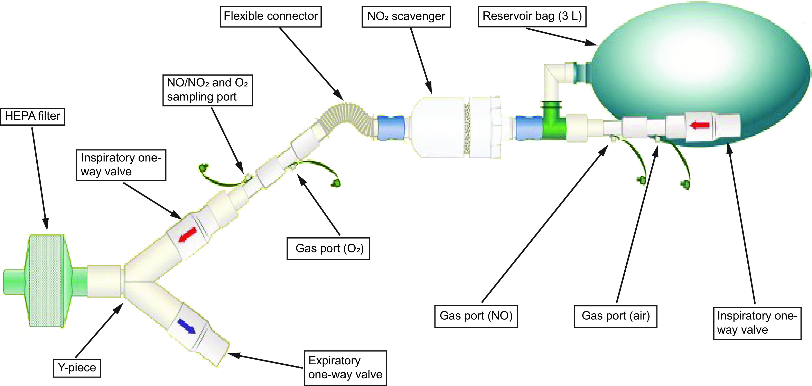{fig-align="center"}

:::{.aside}
Gianni S, Fenza RD, Morais CCA, Fakhr BS, Mueller AL, Yu B, et al. High-dose nitric oxide from pressurized cylinders and nitric oxide produced by an electric generator from air. Respir Care 2022;67(2):201-208.
:::

## Illustration of Methods

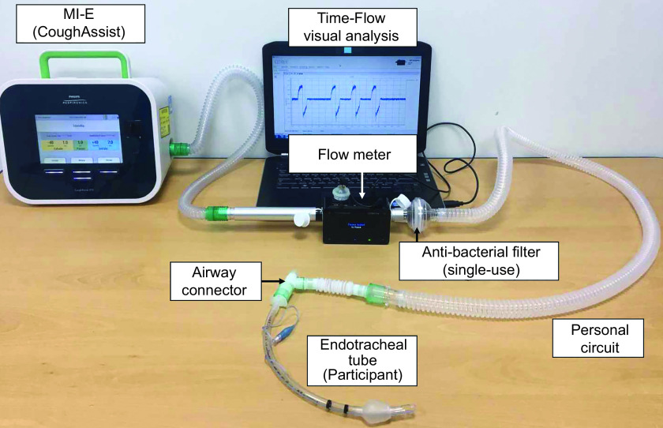{fig-align="center"}

:::{.aside}
Hyun SE, Lee S-M, Shin H-I. Peak expiratory flow during mechanical insufflation-exsufflation: endotracheal tube versus face mask. Respir Care 2021;66(12):1815-1823.
:::

## Illustration of Methods

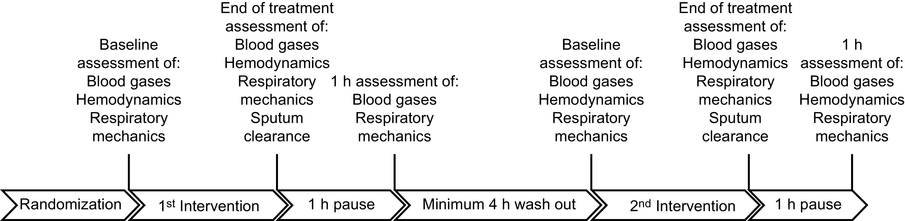 {fig-align="center"}


:::{.aside}
Martinez-Alejos R, Marti J-D, Li Bassi G, Gonzalez-Anton D, Pilar-Diaz X, Reginault T, et al. Effects of mechanical insufflation-exsufflation on sputum volume in mechanically ventilated critically ill subjects. Respir Care 2021;66(9):1371-1379.
:::


## Take Away Message {.center}

<br>

> Write your Methods so a **stranger could reproduce your study** without frustration !!!


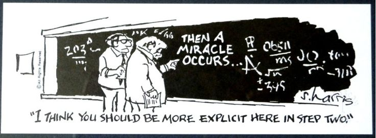{fig-align="center"}


# Questions?

# Thank You!
